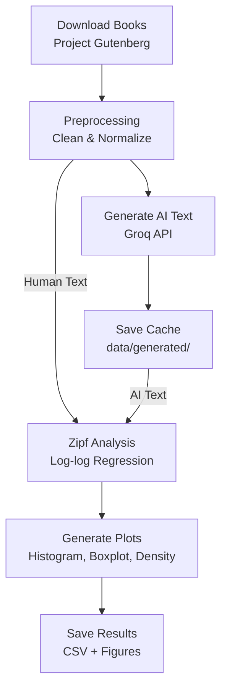

<h1 align="center">ETL Zipf Law Analysis</h1>

<p align="center">
  <em>Human text vs. AI-generated text — a data-driven comparison of Zipf's Law distributions</em>
</p>

<p align="center">
  <a href="https://www.python.org/"></a>
  <a href="https://groq.com/"></a>
  <a href="https://numpy.org/"></a>
  <a href="https://pandas.pydata.org/"></a>
  <a href="https://scipy.org/"></a>
  <a href="https://matplotlib.org/"></a>
  <a href="https://github.com/tqdm/tqdm"></a>
  <a href="https://github.com/theskumar/python-dotenv"></a>
  <a href="https://docs.pytest.org/"></a>
  <a href="https://opensource.org/licenses/MIT"></a>
</p>

---

## 🇧🇷 Resumo do Projeto (PT-BR)

Este projeto consiste em um pipeline de dados desenvolvido para verificar empiricamente se textos sintéticos gerados por LLMs (Corpus Artificial — CA) reproduzem a Lei de Zipf ($f(r) \approx \frac{C}{r^{\alpha}}$) na mesma proporção e comportamento observados na literatura humana clássica (Corpus Natural — CN)."

---

## Mathematical Background & Overview

**Zipf's Law** is an empirical power law in quantitative linguistics stating that in a given corpus of natural language, the frequency $f(r)$ of any word is inversely proportional to its rank $r$ in the frequency table:

$$f(r) \approx \frac{C}{r^{\alpha}}$$

When transformed into log-log space, this power-law relationship yields a linear equation:

$$\log f(r) = \log C - \alpha \log r$$

Where:

- $r$ represents the word rank ($1$ for the most frequent word, $2$ for the second most frequent, etc.).
- $f(r)$ represents the observed frequency of the word at rank $r$.
- $\alpha$ is the Zipf decay exponent ($\alpha \approx 1.0$ for standard natural languages).
- $C$ is a normalization constant.

This project implements an end-to-end Python pipeline to evaluate whether modern Large Language Models (LLMs) adhere to this fundamental linguistic property or exhibit statistical divergence from human-written text.

---

## Project Structure

```text
etl-zipf-law-analysis/
├── data/
│   ├── external/       # Metadata & Gutenberg ID manifests (e.g., gutenberg_ids.csv)
│   ├── generated/      # Synthetic text outputs generated via Groq API (CA)
│   ├── processed/      # Cleaned and tokenized datasets
│   └── raw/            # Ingested raw text files from Project Gutenberg (CN)
├── docs/               # Technical documentation & project images
├── logs/               # Pipeline execution logs
├── outputs/
│   ├── figures/        # Generated plots (histograms, log-log fits, density curves)
│   ├── reports/        # Analytical summary reports
│   ├── tables/         # Summary statistical tables
│   └── zipf_results.csv# Final calculated alpha values, R² metrics, and Gutenberg IDs
├── src/
│   ├── analysis/       # OLS regression in log-log space & Kolmogorov-Smirnov test
│   ├── data/           # Gutenberg downloading, text cleaning, & tokenization
│   ├── models/         # Groq API integration (LLaMA-3) & rate-limit handling
│   ├── pipelines/      # Pipeline orchestration workflow
│   ├── utils/          # File management, logging, & helper functions
│   └── visualization/  # Matplotlib & Seaborn chart generation
├── tests/              # Unit test suite (pytest)
├── main.py             # Main execution CLI script
├── pyproject.toml      # Project configuration & dependencies
├── requirements.txt    # Production dependencies
└── requirements-dev.txt# Development & testing dependencies
```

---

## Key Pipeline Stages

1. **Automated Data Collection (CN)**: Ingests classical literature directly from Project Gutenberg using configurable manifests.
2. **LLM Text Generation & Resilience (CA)**: Interfaces with the Groq API to generate synthetic control texts matching the style/theme of human samples, incorporating exponential backoff for rate limits (HTTP 429).
3. **Power-Law Regression Modeling**: Computes rank-frequency metrics and performs linear regression in log-log space to fit Zipf exponents ($\alpha$) and coefficients of determination ($R^2$).
4. **Hypothesis Testing & Statistical Inference**: Runs a two-sample Kolmogorov-Smirnov (KS) test (`scipy.stats.ks_2samp`) to determine if human and synthetic $\alpha$ distributions originate from the same underlying distribution.
5. **Data Visualization**: Saves analytical plots including log-log rank-frequency curves, boxplots, and comparative histograms.

---

## Features

- Automatic downloading of books from Project Gutenberg
- Text preprocessing and cleaning
- Text generation via Groq API with disk caching
- Zipf's Law calculation ($\alpha$, $R^2$) using log-log linear regression
- Kolmogorov-Smirnov test between distributions
- Generation of comparative plots (histogram, boxplot, density)
- Idempotent pipeline with checkpointing and resume support
- API response caching in `data/generated/`
- Structured logging with timestamps
- Test suite with pytest

---

## Tech Stack

| Category             | Technology              |
| -------------------- | ----------------------- |
| Language             | Python 3.10+            |
| Text Generation      | Groq API (LLaMA 3.1 8B) |
| Scientific Computing | NumPy                   |
| Data Analysis        | pandas, SciPy           |
| Visualization        | Matplotlib              |
| Progress Bar         | tqdm                    |
| Configuration        | python-dotenv           |
| Testing              | pytest                  |
| Code Quality         | ruff                    |

---

## Pipeline



### Checkpointing & Caching

- **Checkpoint:** The pipeline reads `outputs/zipf_results.csv` on startup and resumes execution from the last processed book.
- **AI Cache:** Generated texts are saved to `data/generated/{book_id}.txt`. If the file already exists, the API is not called.

### Metrics

| Metric       | Description                                                  |
| ------------ | ------------------------------------------------------------ |
| **$\alpha$** | Zipf coefficient (slope in the log-log plot)                 |
| **$R^2$**    | Goodness of linear fit                                       |
| **KS test**  | Kolmogorov-Smirnov test comparing human and AI distributions |

---

## Getting Started

### Prerequisites

- Python 3.10+
- Virtual environment (`venv` or `conda`) or Google Colab

### Installation

1. **Clone the repository**:

   ```bash
   git clone [https://github.com/your-username/etl-zipf-law-analysis.git](https://github.com/your-username/etl-zipf-law-analysis.git)
   cd etl-zipf-law-analysis
   ```

2. **Create and activate virtual environment**:

   ```bash
   python3 -m venv .venv
   source .venv/bin/activate  # On Windows: .venv\Scripts\activate
   ```

3. **Install dependencies**:

   ```bash
   pip install -r requirements.txt
   pip install -r requirements-dev.txt  # Optional: for testing and linting
   ```

4. **Environment Configuration**:
   Copy `.env.example` to `.env` and set your Groq API key:
   ```bash
   cp .env.example .env
   ```
   Add your key inside `.env`:
   ```env
   GROQ_API_KEY=your_groq_api_key_here
   ```

---

## Running the Pipeline

To execute the complete pipeline (downloading, generating synthetic texts, fitting regressions, running hypothesis tests, and producing charts):

```bash
python main.py
```

### Execution Steps

1. Reads Gutenberg book IDs from `data/external/gutenberg_ids.csv`.
2. Downloads and cleans raw texts in `data/raw/`.
3. Calls Groq API to generate synthetic texts in `data/generated/`.
4. Preprocesses and normalizes token samples in `data/processed/`.
5. Fits linear regressions in log-log space and runs Kolmogorov-Smirnov tests.
6. Exports statistics to `outputs/zipf_results.csv` and outputs visual charts in `outputs/figures/`.

---

## Running Tests

Unit tests cover file management, preprocessing, statistics, and Zipf regression algorithms. Run tests using `pytest`:

```bash
pytest
```

To run tests with coverage reporting:

```bash
pytest --cov=src tests/
```

---

## Analytical Outputs

Upon completion, outputs are exported to the `outputs/` directory:

| Output File           | Description                                                                                                |
| :-------------------- | :--------------------------------------------------------------------------------------------------------- |
| `zipf_results.csv`    | Dataset containing Gutenberg IDs, calculated $\alpha$ parameters, $R^2$ values, and corpus labels (CN/CA). |
| `zipf_loglog_fit.png` | Rank vs. Frequency plot in log-log space comparing CN and CA fitted regression lines.                      |
| `alpha_histogram.png` | Comparative histogram of estimated Zipf decay exponents $\alpha$ (Human vs. AI).                           |
| `alpha_density.png`   | Kernel Density Estimation (KDE) curve for Zipf exponents.                                                  |
| `alpha_boxplot.png`   | Boxplot displaying distribution medians, IQRs, and outliers of $\alpha$.                                   |
| `r2_histogram.png`    | Goodness-of-fit ($R^2$) distribution across analyzed works.                                                |

---

## License

This project is licensed under the MIT License - see the [LICENSE](LICENSE) file for details.
