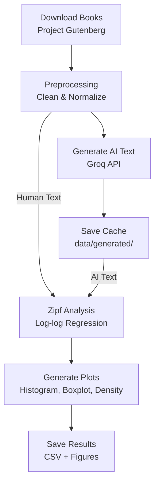
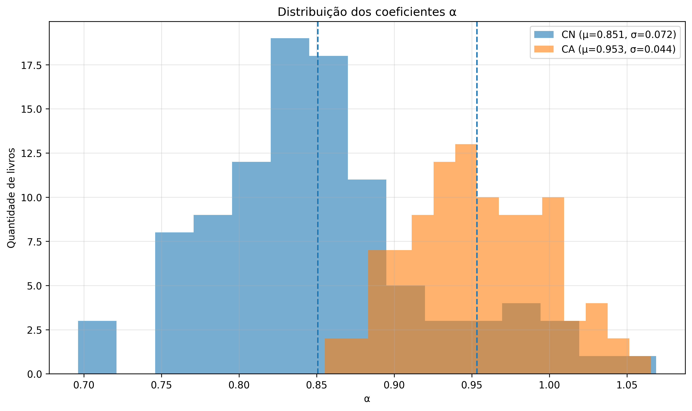
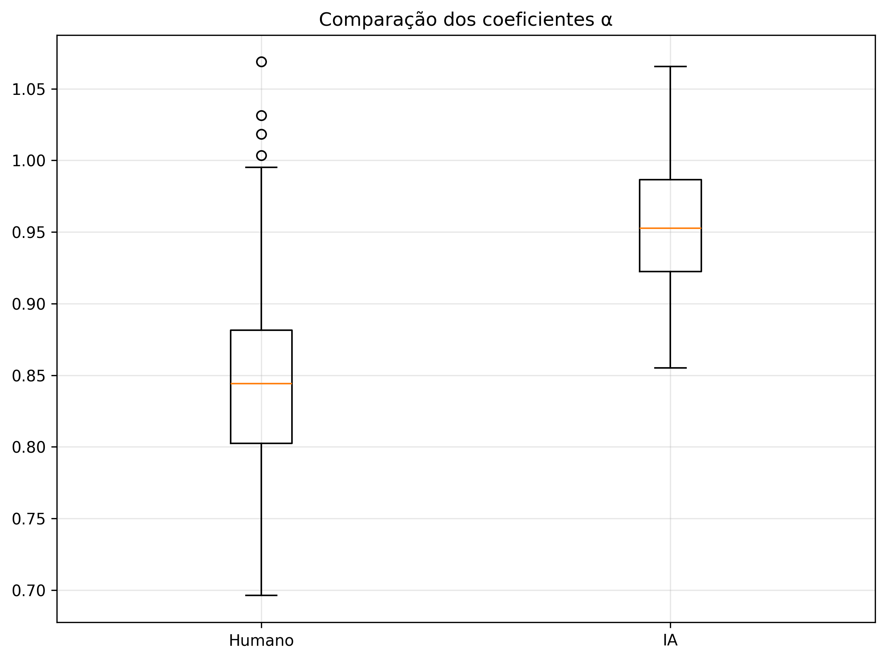
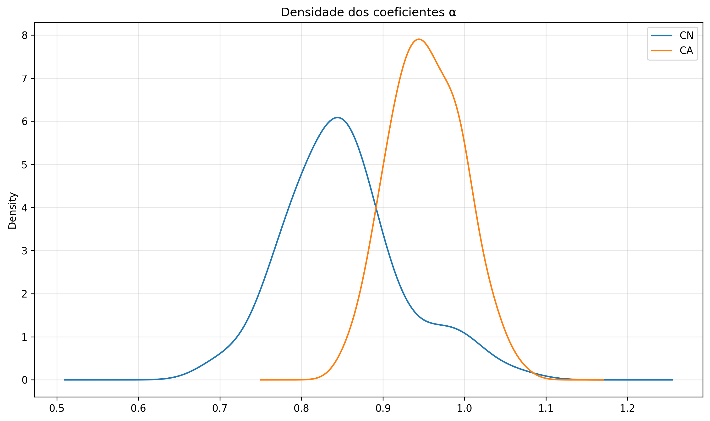
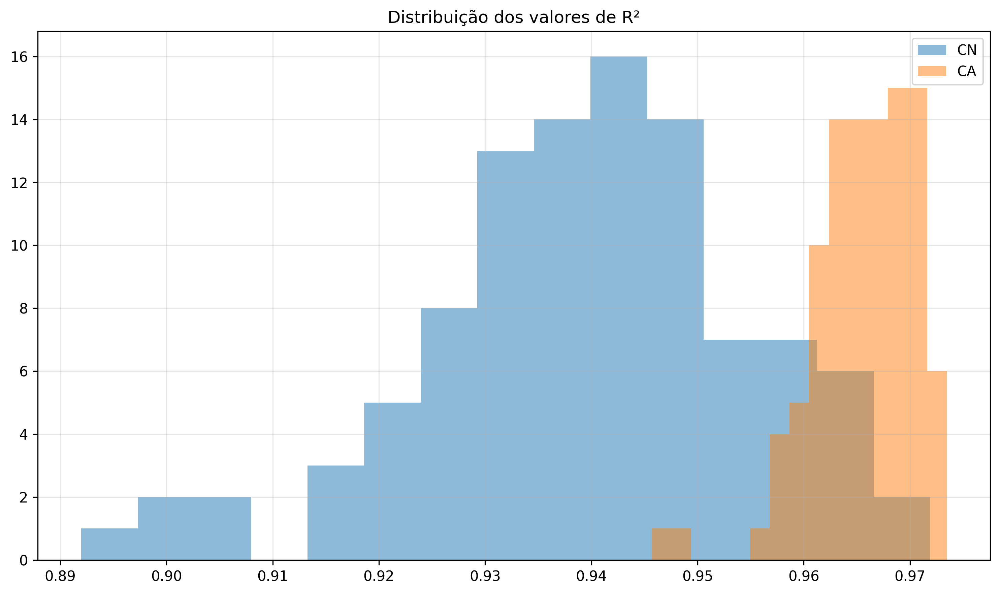
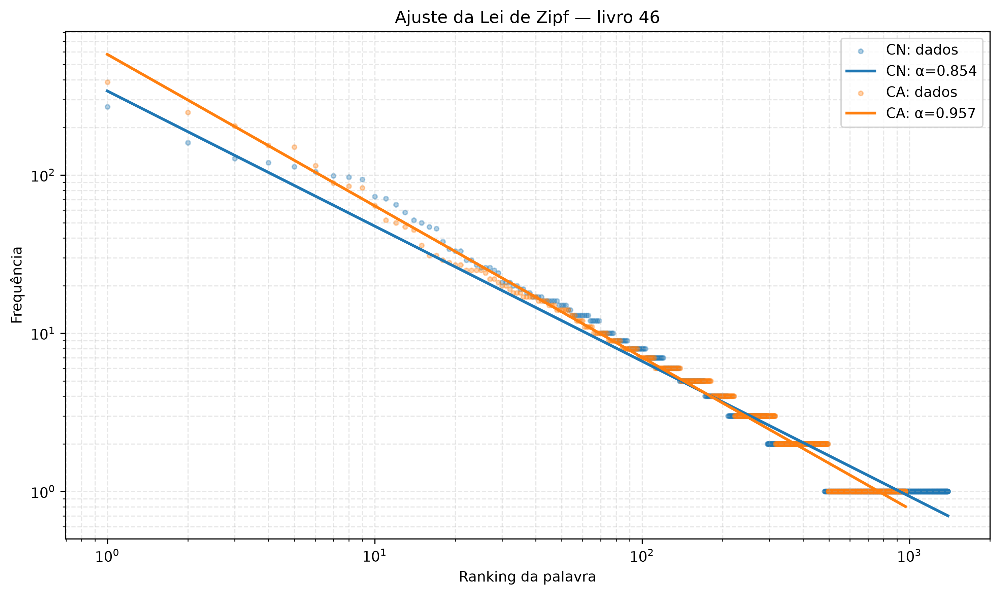

<h1 align="center">ETL Zipf Law Analysis</h1>

<p align="center">
  <em>Human text vs. AI-generated text — a data-driven comparison of Zipf's Law distributions</em>
</p>

<p align="center">
  <a href="https://www.python.org/"></a>
  <a href="https://groq.com/"></a>
  <a href="https://numpy.org/"></a>
  <a href="https://pandas.pydata.org/"></a>
  <a href="https://scipy.org/"></a>
  <a href="https://matplotlib.org/"></a>
  <a href="https://github.com/tqdm/tqdm"></a>
  <a href="https://github.com/theskumar/python-dotenv"></a>
  <a href="https://docs.pytest.org/"></a>
  <a href="https://opensource.org/licenses/MIT"></a>
</p>

---

## Descrição

Pipeline de Engenharia de Dados que investiga se textos gerados por Inteligência Artificial seguem a mesma **Lei de Zipf** observada em textos humanos.

**Problema:** A Lei de Zipf (f ∝ r⁻ᵅ, com α ≈ 1) é uma propriedade empírica da linguagem natural. LLMs reproduzem essa distribuição ou apresentam desvios?

**Metodologia:** O pipeline baixa livros do Project Gutenberg, gera textos equivalentes via Groq API (LLaMA 3.1 8B), calcula o coeficiente α por regressão linear log-log e compara estatisticamente as duas populações com teste KS.

**Hipótese nula (H₀):** A distribuição dos coeficientes α de textos gerados por IA é igual à de textos humanos.

---

## Features

- Download automático de livros do Project Gutenberg
- Pré-processamento e limpeza de texto
- Geração de textos via Groq API com cache em disco
- Cálculo da Lei de Zipf (α, R²) por regressão linear log-log
- Teste de Kolmogorov-Smirnov entre distribuições
- Geração de gráficos comparativos (histograma, boxplot, densidade)
- Pipeline idempotente com checkpoint e retomada
- Cache de respostas da API em `data/generated/`
- Logging estruturado com timestamp
- Conjunto de testes com pytest

---

## Tecnologias

| Categoria             | Tecnologia              |
| --------------------- | ----------------------- |
| Linguagem             | Python 3.10+            |
| Geração de Texto      | Groq API (LLaMA 3.1 8B) |
| Computação Científica | NumPy                   |
| Análise de Dados      | pandas, SciPy           |
| Visualização          | Matplotlib              |
| Progresso             | tqdm                    |
| Configuração          | python-dotenv           |
| Testes                | pytest                  |
| Qualidade             | ruff                    |

---

## Arquitetura

O projeto segue **Clean Architecture** e **Separation of Concerns**, organizado em camadas:

```
.
├── data/
│   ├── raw/              # Textos brutos do Gutenberg
│   ├── processed/        # Textos limpos e normalizados
│   ├── generated/        # Textos gerados por IA (cache)
│   └── external/         # Dados externos de referência
│
├── outputs/
│   ├── figures/          # Gráficos gerados (PNG, 300dpi)
│   ├── tables/           # Tabelas de resultados (CSV)
│   └── reports/          # Relatórios de prompt (markdown)
│
├── docs/
│   └── images/           # Imagens do README
│
├── logs/                 # Logs do pipeline
├── notebooks/            # Jupyter notebooks para exploração
│
├── src/
│   ├── data/
│   │   ├── loader.py           # Download de livros
│   │   └── preprocessing.py    # Limpeza e normalização
│   │
│   ├── models/
│   │   └── groq_generator.py   # Interface com API Groq
│   │
│   ├── pipelines/
│   │   └── pipeline.py         # Orquestração do experimento
│   │
│   ├── analysis/
│   │   ├── zipf.py             # Cálculos da Lei de Zipf
│   │   └── statistics.py       # Indicadores estatísticos
│   │
│   ├── visualization/
│   │   └── plots.py            # Geração de gráficos
│   │
│   ├── utils/
│   │   ├── logger.py           # Configuração de logging
│   │   ├── file_manager.py     # Operações de arquivo
│   │   └── helpers.py          # Funções auxiliares
│   │
│   └── config.py               # Configurações centralizadas
│
├── tests/
│   ├── test_preprocessing.py
│   ├── test_zipf.py
│   ├── test_statistics.py
│   └── test_file_manager.py
│
├── main.py                     # Ponto de entrada
├── requirements.txt            # Dependências
├── requirements-dev.txt        # Dependências de desenvolvimento
├── pyproject.toml              # Configuração do projeto
└── .env.example                # Template de variáveis de ambiente
```

---

## Pipeline



### Checkpoint & Cache

- **Checkpoint:** O pipeline lê `outputs/zipf_results.csv` ao iniciar e retoma do último livro processado.
- **Cache IA:** Textos gerados são salvos em `data/generated/{book_id}.txt`. Se o arquivo existir, a API não é chamada.

### Métricas

| Métrica     | Descrição                                           |
| ----------- | --------------------------------------------------- |
| **α**       | Coeficiente de Zipf (inclinação no gráfico log-log) |
| **R²**      | Qualidade do ajuste linear                          |
| **KS test** | Kolmogorov-Smirnov entre distribuições humana e IA  |

---

## Instalação

```bash
# Clone o repositório
git clone https://github.com/seu-usuario/zipf-human-vs-ai.git
cd zipf-human-vs-ai

# Crie o ambiente virtual
python -m venv .venv

# Ative o ambiente
## Windows
.venv\Scripts\activate
## Linux/macOS
source .venv/bin/activate

# Instale as dependências
pip install -r requirements.txt

# (Opcional) Modo editável para desenvolvimento
pip install -e .

# Configure as variáveis de ambiente
cp .env.example .env
```

Edite o arquivo `.env`:

```env
GROQ_API_KEY=sua_chave_aqui
GROQ_MODEL=llama-3.1-8b-instant
TARGET_WORDS=5000
MAX_BOOKS=100
```

---

## Como Executar

```bash
python main.py
```

Para uma execução rápida de validação (2 livros, 500 palavras):

```bash
MAX_BOOKS=2 TARGET_WORDS=500 python main.py
```

### Artefatos Gerados

| Arquivo                                     | Descrição                        |
| ------------------------------------------- | -------------------------------- |
| `outputs/zipf_results.csv`                  | Resultados por livro (α, R²)     |
| `outputs/tables/descriptive_statistics.csv` | Média, mediana, desvio, min, max |
| `outputs/tables/ks_test.csv`                | Teste Kolmogorov-Smirnov         |
| `outputs/figures/alpha_histogram.png`       | Histograma dos coeficientes α    |
| `outputs/figures/alpha_boxplot.png`         | Boxplot humano vs. IA            |
| `outputs/figures/alpha_density.png`         | Densidade dos coeficientes       |
| `outputs/figures/r2_histogram.png`          | Distribuição do R²               |
| `outputs/figures/zipf_loglog_fit.png`       | Ajuste log-log de exemplo        |
| `logs/pipeline.log`                         | Log detalhado da execução        |

---

## Testes

```bash
pip install -r requirements-dev.txt
pytest
```

---

## Resultados

### Histograma dos coeficientes α



### Boxplot humano vs. IA



### Densidade dos coeficientes α



### Distribuição do R²



### Ajuste da Lei de Zipf (log-log)



---